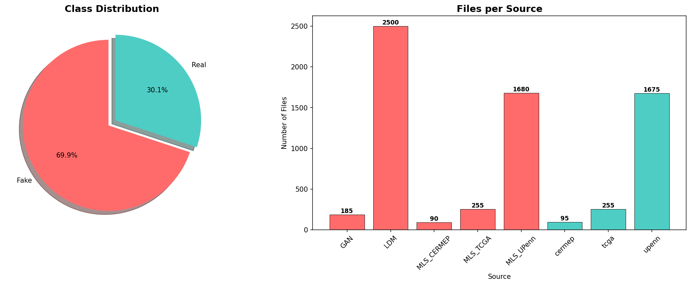
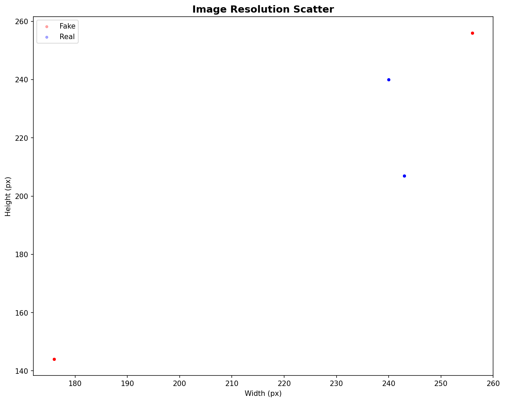
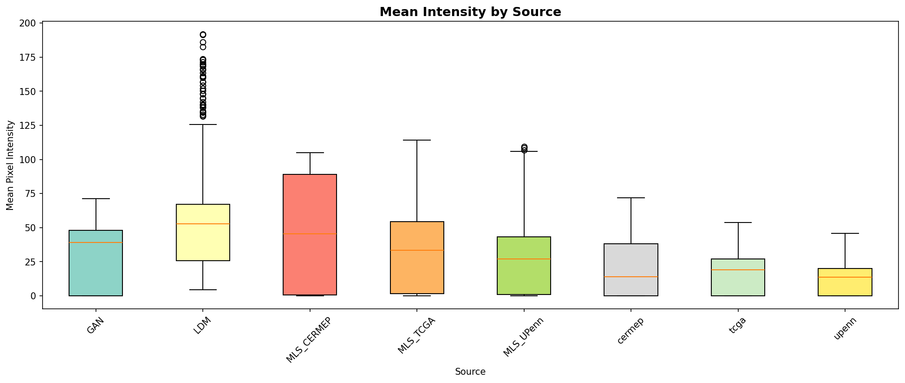
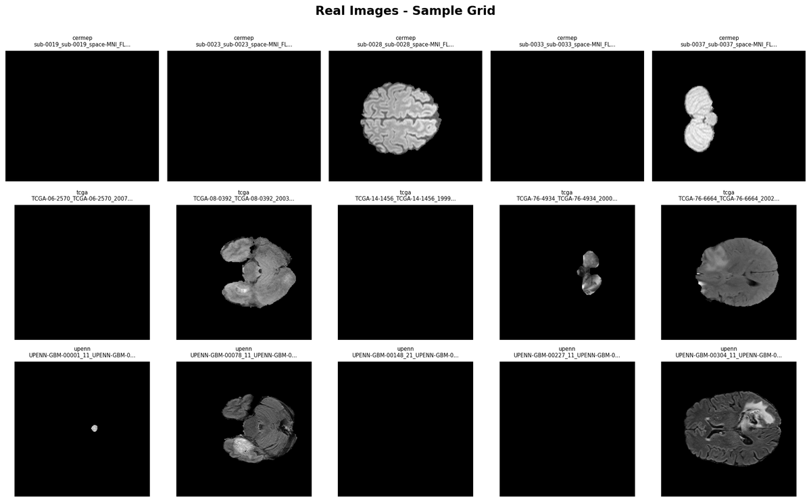
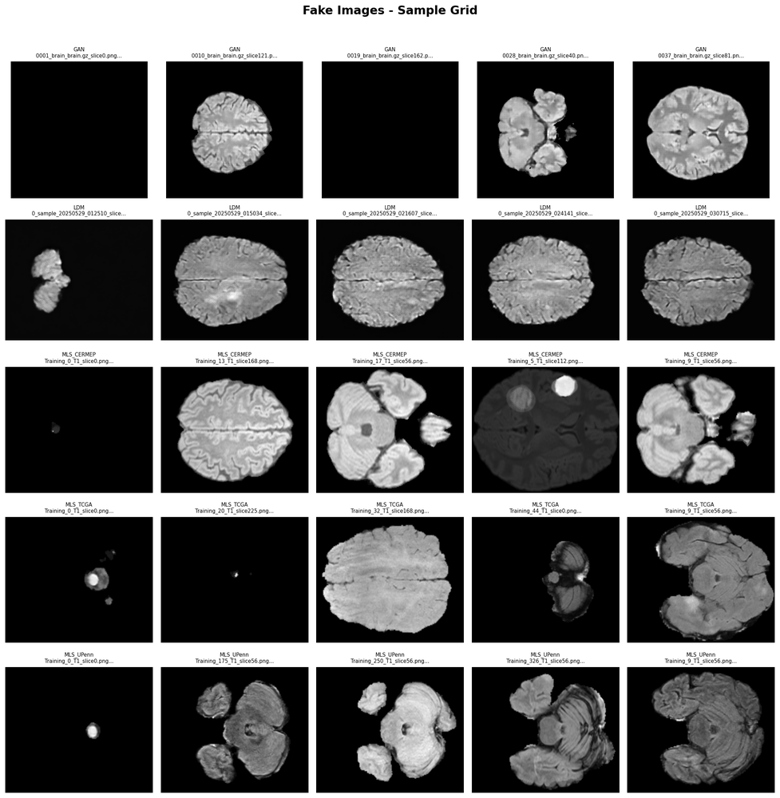

# Hyperbolic CLIP for Real vs Synthetic MRI Classification

Detecting AI-generated synthetic MRI brain scans using hyperbolic geometry-aware CLIP embeddings.

## Problem Statement

Advances in generative models (GANs, Latent Diffusion Models, Medical Latent Synthesizers) have made it possible to produce realistic synthetic MRI brain images. This poses risks in clinical settings where authenticity matters. This project develops a classifier that distinguishes real MRI scans from synthetic ones, leveraging CLIP features projected into hyperbolic space to capture the hierarchical structure of medical image representations.

## Dataset

The **RGIIIT** dataset contains 6,735 grayscale MRI brain slice images across 8 sources:

| Class | Sources | Images |
|-------|---------|--------|
| **Real** | cermep, tcga, upenn | 2,025 |
| **Fake** | GAN, LDM, MLS_CERMEP, MLS_TCGA, MLS_UPenn | 4,710 |

After cleaning (blank removal, deduplication, pHash quarantine), the final dataset contains **5,121 images** split 70/15/15 at the subject level.

> The raw dataset is **not included** in this repository. See [data/README.md](data/README.md) for setup instructions.

## Phase 1: Dataset Preparation (Complete)

- **Audit**: 10-step comprehensive quality analysis (integrity, statistics, duplicates, leakage, anomalies, FFT)
- **Cleaning**: Blank removal, MD5 deduplication, cross-class pHash quarantine
- **Splitting**: Subject-level stratified 70/15/15 train/val/test
- **Validation**: 10 automated checks — all passed

See [docs/phase_1_dataset_preparation.md](docs/phase_1_dataset_preparation.md) for details.

## Dataset Snapshot

**Class Distribution**



**Resolution Distribution (before cleaning)**



**Intensity Distribution by Source**



**Sample Real MRI Slices**



**Sample Synthetic MRI Slices**



## Planned Approach (Phase 2+)

1. **Feature extraction** — CLIP ViT encoder on resized 224×224 grayscale MRI slices
2. **Hyperbolic projection** — Map CLIP embeddings into Poincaré ball via exponential map
3. **Classification** — Hyperbolic logistic regression / MLR in curved space
4. **Evaluation** — Per-source accuracy, cross-source generalization, FFT artifact analysis

## Repository Structure

```
├── assets/                   # Curated visuals for README
├── configs/                  # Training configs (Phase 2+)
├── data/
│   └── README.md             # Dataset setup instructions
├── dataset_audit/
│   ├── reports/              # Audit CSVs, JSONs, Markdown report
│   ├── plots/                # Audit visualizations
│   └── samples/              # Sample image grids
├── dataset_cleaning/
│   ├── split_manifest.csv    # Per-image manifest
│   ├── cleaning_log.csv      # All cleaning actions
│   ├── subject_split_map.json
│   └── dataset_config.json   # Pipeline config
├── docs/
│   ├── phase_1_dataset_preparation.md
│   └── phase_1_dataset_preparation_detailed.md
├── experiments/              # Experiment logs (Phase 2+)
├── notebooks/                # Jupyter notebooks
├── scripts/
│   ├── audit/                # Dataset audit script
│   ├── cleaning/             # Cleaning + splitting pipeline
│   └── validation/           # Post-clean validation
├── src/                      # Model source code (Phase 2+)
├── .gitignore
├── LICENSE
└── README.md
```

## Running Dataset Preparation

```bash
# 1. Audit the raw dataset
python scripts/audit/run_dataset_audit.py

# 2. Clean, deduplicate, split, and resize
python scripts/cleaning/clean_and_split_dataset.py

# 3. Validate the cleaned dataset (10 checks)
python scripts/validation/validate_clean_dataset.py
```

**Requirements**: Python 3.11+, PIL, OpenCV, numpy, pandas, matplotlib, imagehash, tqdm

## Future Work

- **Phase 2**: Model development — CLIP feature extraction + hyperbolic projection
- **Phase 3**: Training and evaluation pipeline
- **Phase 4**: Ablation studies and cross-source generalization analysis

## License

Apache License 2.0 — see [LICENSE](LICENSE).
